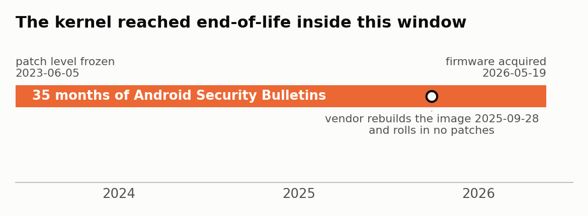

# Chapters 9, 10 and 11

> Published 2026-09-01. Disclosure status is in the front matter.

---

# Chapter 9 - Code delivery

Chapter 5 established that the device cannot tell a legitimate update from a forged
one. This chapter counts the doors.

## 9.1 Six channels, not one

The initial reporting described a single silent-install path. A systematic permission
audit found six.

| # | Package | Cover identity | Capability |
|---|---|---|---|
| 1 | `com.abupdate.fota_demo_iot` | ADUPS OTA client | `INSTALL_PACKAGES`, `RECOVERY`, `INTERACT_ACROSS_USERS_FULL`. Doze-exempt. |
| 2 | `install_suding_so.sh` | shell script | Loads any `.so` dropped in `/storage/emulated/0/suding_libs/`. No network required. |
| 3 | `com.atoto.carsysteminfo` | "car info" reader | Signature-level `INSTALL_PACKAGES`, `READ_PRIVILEGED_PHONE_STATE`, `CAMERA` |
| 4 | `com.aidl.atoto.store` | "find apps" helper | `REQUEST_INSTALL_PACKAGES`, `REQUEST_DELETE_PACKAGES`, `QUERY_ALL_PACKAGES`, `PACKAGE_USAGE_STATS` |
| 5 | `com.atoto.command.dispatcher.service` | "drive chat" | `INSTALL_PACKAGES`, `READ_SMS`, `RECORD_AUDIO`, `SYSTEM_ALERT_WINDOW` |
| 6 | `net.esimx.lpaui` | eSIM profile manager | `WRITE_SECURE_SETTINGS`, `MODIFY_PHONE_STATE`, `REQUEST_INSTALL_PACKAGES` |


`INSTALL_PACKAGES` is not `REQUEST_INSTALL_PACKAGES`. The former installs with no user
dialog and is signature-level, meaning it cannot be granted to a third party
application. Four of these hold it. They hold it because they are signed with the
platform key from §5.1, which is public.

Channel 5 is worth reading twice. An application called "drive chat" holds silent
install, SMS read, microphone, and overlay. The name explains none of those.

## 9.2 The channels are not dormant

From the live extraction:

```
key_period_interval_time   90000000 ms          25-hour poll
key_previous_time          1779184027152        2026-05-19 09:47 UTC
state                      CHECK_NEW_VERSION
```

The ADUPS client was polling and in a state that means it was asking for an update at
the moment the device was isolated. `/system/etc/permissions/platform.xml` grants it
`allow-in-power-save`, so Android's Doze cannot suspend it.

Independent of the network channels, `sudingtech.oss-cn-shenzhen.aliyuncs.com` is an
Alibaba Cloud Shenzhen object store referenced from OEM code, giving the manufacturer
a delivery path that does not traverse ADUPS at all.

## 9.3 What arrives has the platform's authority

Anything delivered by any of the six channels is installed by a platform-signed
installer, on a device whose platform key is public, onto a system where signature
permissions therefore mean nothing. A delivered APK can hold `INJECT_EVENTS`,
`READ_LOGS`, `FORCE_STOP_PACKAGES` and `INTERACT_ACROSS_USERS_FULL` because the OEM's
own applications already do.

## 9.4 Thirty-five months of unpatched CVEs

```
ro.build.version.security_patch    2023-06-05
ro.vendor.build.security_patch     2023-06-01
kernel                             Linux 4.19.157   released 2020-10-29
                                                    4.19 LTS EOL December 2024
build date                         2025-09-28
```

The vendor re-spun the build in late 2025 and rolled no Android Security Bulletin
patches into it. The patch level has been frozen since June 2023, across at least one
rebuild.



That is roughly thirty-five monthly bulletins, an EOL'd kernel LTS line, and the
Qualcomm platform bulletins for SDM662 over the same window.

It matters because it decouples the threat from the vendor. Chapters 5 and 9 describe
what the manufacturer can do deliberately. Patch staleness describes what an
unaffiliated attacker can do with published work. Two independent roads to the same
place.

## 9.5 Observation: a root service that loads its library from application storage

This section is an observation, not a finding. It is written up because the shape of
it is worth a reader's attention, and because the evidence available here points
toward it being blocked rather than exploitable. It is included at that strength
rather than left out, so nobody has to rediscover it.

`init.rc` line 1442 starts a service that is not disabled and does not transition out
of the init domain:

```
service sd-link /system/bin/sd-link.sh
  class core
  user root
  group root
  seclabel u:r:init:s0
```

`class core` means it starts early and restarts if it dies. There is no `disabled`
flag, so nothing has to ask for it. `seclabel u:r:init:s0` is set explicitly and there
is no matching `typetransition`, so the script runs in the init domain rather than
dropping into a service domain of its own.

The script itself is nine lines:

```sh
export LD_LIBRARY_PATH=/data/data/com.suding.speedplay/lib

while true;do
    setprop persist.sys.speedplay.cp.wired.disa 1
    setprop sys.suding.speedplay.apk com.suding.speedplay
    if [ -f /data/data/com.suding.speedplay/lib/libspeedplay.so ]; then
        $EXE_PATH/sd_carplay -c $CHANNEL
    fi
    sleep 1
done
```

Three properties of that loop are worth stating precisely.

`LD_LIBRARY_PATH` points into application data. `/data/data/com.suding.speedplay/lib`
is not on any read-only partition and is not covered by Verified Boot.

`sd_carplay` resolves through it. The binary carries `libspeedplay.so` as a
`DT_NEEDED` entry and has no `DT_RUNPATH` or `DT_RPATH`, so the exported path is what
the loader consults first for that name.

The loop never stops asking. It tests for the file every second, for the life of the
device.

Put together, that is a root process in the init domain that will load a library from
a writable application directory, within one second of the file appearing there.

**What stops it: the policy does not connect those two ends.**

The obvious check is to grep the policy for a rule granting the init domain access to
`app_data_file`. That check is not sufficient, and it is worth saying why, because a
reviewer repeating it can be misled in either direction. An allow rule can reach a
domain through an attribute the domain belongs to, never naming the domain. And
Android's policy compiler emits attributes named `base_typeattr_N` whose membership is
a set expression, very often of the form `(and (something) (not (app_data_file)))`. An
attribute whose definition *mentions* `app_data_file` is frequently the set that
*excludes* it. Matching on mention rather than membership is how a grep produces a
confident wrong answer.

`sepolicy_reach.py` was written to settle it properly. It reads all five policy files
the device ships, `plat`, `vendor`, `plat_pub_versioned`, `product` and `system_ext`,
and evaluates the set expressions rather than flattening them, resolving `and`, `or`,
`not`, `all` and `xor` over the 2,592 declared types with memoisation and a cycle
guard. It then expands both sides of every one of the 21,014 allow-family rules and
asks which of them connect a label init is a member of to a label the app data types
are members of.

```
declared types      2,592        declared attributes  3,366
allow-family rules  21,014
labels init is a member of                  815
labels the app data types are members of    132

allow rules connecting init -> app_data_file        0
allow rules connecting init -> privapp_data_file    0
```

The difference the evaluation makes is not academic. Flattening the set expressions
instead of evaluating them returns seventeen apparent hits. Every one is an exclusion
set: `base_typeattr_486`, `488`, `490` and `570` each resolve to hundreds of types and
none of them contains `app_data_file`. The naive answer and the correct answer are
opposites.

Controls were run in both directions before trusting that zero. `init` resolves as a
member of `domain`, `app_data_file` as a member of `file_type`, and the domains that
must be able to reach application data do: `system_server`, `zygote` and `installd`
all return allow rules on `app_data_file`. The machinery finds rules where rules
exist, and finds none here.

So with SELinux enforcing, the `[ -f ... ]` test fails, and the loader never gets as
far as opening the library. **On the policy this device currently carries, this does
not work.** Section 9.6 is about how much weight that sentence can hold.

**Confirmed against the binary the device loads.** The analysis above is of the source
CIL. The device boots `vendor/etc/selinux/precompiled_sepolicy`, and a hand-written
evaluator agreeing with itself proves nothing, so the same question was put to that
binary with `sesearch` from upstream `setools` 4.4.4:

```
policy version 30, MLS enabled, 2,593 types, 296 attributes, 49,942 allow rules

sesearch --allow -s init -t app_data_file          0 rules
sesearch --allow -s init -t privapp_data_file      0 rules

auditallow, dontaudit and type_transition on the same pairs   0, 0, 0
```

Controls again, on the compiled policy this time: `system_server` returns 2 allow
rules on `app_data_file`, `zygote` 1, `installd` 10. The query finds rules where rules
exist.

Two independent methods, one written for this analysis and one the upstream tool,
reading two different artifacts, return the same answer. The init domain has no path
to application data on this device, by any rule type.

**What remains open.** No boot-time audit log was captured, so the denial is inferred
from the policy rather than observed firing. That is a small residual and it does not
affect the result.

The section stays at observation strength on that basis, and it stays out of the
severity argument in Chapter 5 and out of everything filed with Google. What is
recorded here is a design that would be a code-execution path if one policy line were
different, and two independent confirmations that the line is not there.

## 9.6 Why "the policy blocks it" is a weaker statement on this device

The result in 9.5 describes the policy the device is carrying. On most hardware that
is close enough to a permanent property to treat as one, because changing it means
shipping an update and shipping an update means holding a key nobody else has.

That is not the situation here, and the reason is already established in this paper
rather than assumed.

**The policy files sit on partitions an update replaces.** All four live inside the
`super` dynamic partition on A/B slots:

```
plat_sepolicy.cil          2.0 MB   /system        slotselect, avb=vbmeta_system
vendor_sepolicy.cil        697 KB   /vendor        slotselect, avb
product_sepolicy.cil        48 KB   /product       slotselect, avb=vbmeta_system
system_ext_sepolicy.cil    177 KB   /system_ext    slotselect, avb=vbmeta_system
precompiled_sepolicy       971 KB   /vendor        the binary the device loads
```

None of these is a fixed characteristic of the hardware. Each is content in an image,
and an update writes the inactive slot and reboots into it.

**Anyone can sign an update this device installs.** Section 5.2 established that
`otacerts.zip` holds exactly one certificate, the AOSP `testkey`, whose private half
is published. The recovery updater verifies against that and nothing else.

**The delivery channels are present and awake.** Section 9.2 caught the ADUPS client
mid-poll, in `CHECK_NEW_VERSION`, Doze-exempt so it is never suspended.

Those three facts compose. The missing line in 9.5 is one `allow` rule in a file that
travels inside an image, verified by a key anyone has, over a channel that is already
running. Nothing has to be defeated. The mechanism in 9.5 is not absent from this
device; it is shipped, dormant, and waiting on a policy file that the device's own
update path is authorized to rewrite.

### 9.6.1 The eSIM sits underneath all of it

The device carries a soldered eUICC. The Local Profile Assistant that manages it is
`net.esimx.lpaui`, an EIoT Club application of roughly 46 MB built on Flutter,
holding `WRITE_SECURE_SETTINGS`, `MODIFY_PHONE_STATE` and `REQUEST_INSTALL_PACKAGES`.
The live extraction recovered its application data, including a populated Flutter
engine shader cache, so it had run on this unit.

One property of it is worth stating on its own. **It is not in the read-only system
image.** It appears in no partition covered by Verified Boot: not `/system`, not
`/product`, not `/system_ext`, not `/vendor`. It exists on `/data`. The application
that holds the keys to the cellular identity of this device is outside the integrity
boundary that protects everything else about it.

The platform-signed remote SIM stack from section 5.1 sits behind it:
`uimlpaservice`, `uimremoteclient`, `uimremoteserver`, `remotesimlockservice` and
`remoteSimLockAuthentication`, all in `/product/app`, all carrying the published
platform key.

What that adds is not another code-execution path. It is a layer below the ones
already described. An eUICC profile determines which network the device attaches to
and what carrier configuration it applies. The update client polls over whatever that
resolves to. So the network position that the update path depends on is itself
remotely reprovisionable, by a party the owner has no relationship with and cannot
enumerate.

**Stated as evidence rather than as a story.** Proven: the policy files are on
update-replaceable partitions; updates are verified against a published key; the
update client is awake; the LPA is outside Verified Boot with those permissions; the
remote SIM stack is platform-signed; `sd-link.sh` ships and loops. Inferred, and
labeled as such: that an actor able to sign an update can add the one policy line
and thereby make the shipped loader live. Not claimed: that eSIM reprovisioning by
itself yields code execution, or that EIoT Club or the OEM has done any of this.

The correction this section makes is to the reading of 9.5, not to its result. Zero
allow rules is the right answer to the question that was asked. It is a smaller answer
than it looks, because on this device the policy is not a property of the hardware. It
is the contents of a file that the update path is entitled to replace, using a key that
has been public since 2008.

---

# Chapter 10 - This is a reference design, not a product

## 10.1 The corporate shape

```
Shenzhen Suding Technology            Chinese ODM. Designs boards, writes firmware,
  ├── Carsyso                         holds the Google partner credential.
  │     internal SDK division         Owns com.suding.* and com.carsyso.*
  └── white-label output
        ├── Atoto        subject of this analysis
        ├── Carlinkit
        ├── Carsy
        ├── Carnetos
        └── Suding-branded retail

component upstream
  Qualcomm   SDM662 (AI box), QCM6125 (head unit line)
  Quectel    SC200U IoT smart module
```

The evidence for that structure is on the device rather than in a filing.
`CarDataManager.apk`, shipped on an Atoto-branded retail unit, contains
`CARLINKITNAVIGHU9` and `http://data.carlinkit.com:8610` as literals. An Atoto device
queries Carlinkit infrastructure from a binary that knows Carlinkit's product line.

`/system/bin/led.sh` branches on `ro.board.reverse.custom` across eight further brand
profiles including `huawei`, remapping LED pins per brand. Distinct hardware variants,
one firmware.

## 10.2 The same defect is an industry norm, not a brand

An earlier version of this chapter reported that the pattern had also been seen on one
other brand. That understated it by a wide margin, and the correction runs in the
direction of scale.

Six firmware samples across five OEMs have been independently confirmed to ship the
same unauthenticated root-access chain. Three were analyzed in enough depth to compare
directly:

| | Atoto / Suding | Joying / Quzhida | Dasaita / HCT |
|---|---|---|---|
| Product | CarPlay adapter, "AI Box" | in-dash Android head unit | in-dash Android head unit |
| Model | Quectel SC200U | `QZD_G10_Joying` | `G13-V1` |
| Chipset | Qualcomm SM6115 | Qualcomm | Qualcomm **QCM6125** |
| Android | 13 | build `20251129-100012` | 13 |
| Root path | `ro.adb.secure=0` + setuid `sdsu` | `ro.adb.secure=0` + setuid `suu` | `userdebug` + `debuggable=1` + setuid `su`, `hct` |
| Update vendor | ADUPS | Quzhida | HCT's own `HCTUpdateService` |
| Projection stack | Suding SpeedPlay | Quzhida zlink6 | HCT |

**This is not confined to adapters.** Two of the three are in-dash head units, the
unit that replaces the car's factory radio and owns the screen permanently. The AI Box
this paper analyses is the least embedded member of the group.

**The independence is what makes it a finding.** These three share no application-layer
code. Different projection stacks, different APK inventories, different branding,
different update infrastructure, and in Dasaita's case a different Qualcomm chipset
family. Every axis along which they could have inherited the defect from a common
parent is different. What is identical is the outcome: plug in USB, `adb shell`, `su`,
full root, no authentication anywhere in the chain.

A shared BSP explains two products. It does not explain this. The pattern survives a
change of silicon and a change of OTA vendor, which places it in manufacturing
practice rather than in any one codebase.

**One contract manufacturer, several shopfronts.** The Dasaita G13-V1 carries build
host `r940xa` and build user `hct`. So do the Dasaita Vivid 13 and the Eonon A12S,
sold as separate brands. One build machine produces firmware for multiple
consumer-facing names.

**The rebrand machinery is visible in this device's own firmware.** The brand a unit
presents is a string. `ro.board.reverse.custom` selects it, and `led.sh`,
`color_led.sh` and `colorLedSpi.sh` branch on it to remap LED pins per customer. At
least ten distinct customer codenames appear across those scripts and `build.prop`:

```
ronglianfa   chelianyi    chelianyi-SA   huachuang   xiluo
suding       zhijiale     huawei         123         aotule
```

The unit examined here is set to `ro.board.reverse.custom=aotule-ota-led`, a codename
that does not appear in the enumerated list inside `led.sh` at all, which means the
registry in any one script is a floor rather than a census.

`load_services.json` goes further and references five brand namespaces in a single
boot registry: `com.carsyso.mainui`, `carnetos.usbservice`, `com.sd.ball`,
`com.suding.speedplay` and `com.suding.datamanager`. `get_easy_activate_state.sh`
probes for an EasyConn or Carbit license, so the same base image ships as any of
several projection-protocol brands depending only on which license file is present.

### 10.2.1 The vendor left the build template on the device

The strongest evidence that this is one product line wearing different names is not
inferred from comparing units. It is a configuration file the vendor ships in the
system image, `/system/etc/main/main_mpu.cfg`, commented throughout in Chinese, which
is the form a customer fills in to get their own build.

The identity block is eight fields. The vendor's own comments are reproduced in the
right-hand column:

| Field | Value on this unit | Vendor comment |
|---|---|---|
| `vendor` | `suding` | \cjk{软件厂商} software vendor |
| `customer` | `suding` | \cjk{客户名称} customer name |
| `car_brand` | `Volkswagen` | \cjk{汽车品牌} vehicle brand |
| `car_serial` | `toyota` | \cjk{车系} vehicle series |
| `car_type` | `unknown` | \cjk{车型号} vehicle model |
| `mpu_type` | `B0` | \cjk{车机类型} head unit class |
| `mpu_ui_type` | `gold` | UI type |
| `oem_brand` | `ApplePie` | \cjk{oem厂商名称} OEM manufacturer name |

Brand, customer and vehicle are variables. `car_brand=Volkswagen` sitting beside
`car_serial=toyota` on a unit sold as neither is a template with leftover values in
it, which is itself the point: these fields are filled per order.

**`mpu_type` is the part that settles the scope question.** Its comment enumerates the
product classes this one firmware is built for:

| Value | Vendor's term | What it builds |
|---|---|---|
| `F` | \cjk{前装} | factory-fitted |
| `B` | \cjk{后装} | aftermarket |
| `B0` | | the entire aftermarket head unit |
| `B1` | | uses the original car's screen, Android runs on a box, switches the original car system |
| `B2` | | uses the original car's screen, Android runs on a box, no system switch, original car apps migrated to Android |

One codebase, one config schema, spanning factory-fitted head units, aftermarket
head units, and the box category this paper's subject belongs to. The unit examined
here is `B0`. The taxonomy is the vendor's own, written for their own customers.

Two flags in the same file follow the same split:

| Flag | This unit | Vendor comment |
|---|---|---|
| `function_enable_canbox` | `true` | \cjk{主要针对后装项目车型} mainly for aftermarket vehicle models |
| `function_enable_canbus` | `false` | \cjk{主要针对前装项目车型} mainly for factory-fitted vehicle models; true means use the factory CAN protocol |

The firmware carries a factory CAN mode. It is off on this SKU. It is in the image.

`software_provider_mcu_protocol` offers `suding` or `foryou`, the latter being
Foryou Electronics, a Chinese Tier-1 supplier of factory-fitted head units to
automakers. `software_carsyso_canbox_protocol` selects between a Volkswagen MQB
platform serial protocol and a Lexus RX200T serial protocol. `car_type.json` beside
it carries Lexus NX, RX and ES profiles for the 2019 model year.

The update section defines three separate firmware channels, only one of which is
Android:

```
upgrade_can_mcu   .hex   files matching "canbox"
upgrade_main_mcu  .bin   files matching "flash"
upgrade_arm       .img   update.zip
```

The same update path that Chapter 5 showed is verified against a published key also
carries microcontroller images, including the CAN MCU.

**One more thing was left in that directory.** `settings.xls` is a Microsoft Excel
workbook, code page 936, last saved 2019-06-19, shipped inside `/system/etc/` on a
unit sold at retail in the United States. Three of its six rows are developer test
data with placeholder names and comments reading "ha test float" and "kill string".
It is not a security finding. It is a measure of how much of the vendor's internal
build process arrives on the customer's device unexamined.

Brands confirmed or strongly indicated as sharing this firmware architecture: Suding,
Atoto, Carlinkit, Carsy and Carsyso, Carnetos, Joying, Dasaita, Eonon. The `huawei`
profile is present in the registry and is left uninterpreted here; whether it
represents actual Huawei-branded product or unauthorized use of the name is not
established.

**Scale, with its basis stated.** These products have been continuously available on
Amazon US for roughly five years, across multiple brands and multiple ASINs, and are
also sold through AliExpress, eBay and Walmart Marketplace. A conservative aggregate
US installed base is in the tens of thousands of units, with the global figure likely
an order of magnitude higher. That is an estimate from listing longevity and marketplace
breadth, not from sales data, and it is offered at that strength.

That is the finding with reach. A defective product harms its buyers. A defective
manufacturing practice harms everyone downstream of it, propagates by being licensed,
and cannot be fixed by fixing any one brand. Remediating "Atoto" does not remediate
Carnetos, Carlinkit, Carsy, Joying, Dasaita or Eonon, because there was never one
product to remediate.

## 10.3 GMS on an uncertified platform

```
ro.system.build.fingerprint  qti/qssi/qssi:13/TKQ1.230627.001/longtj09282052:user/release-keys
ro.vendor.build.fingerprint  qti/bengal/bengal:11/RKQ1.230607.001/longtj09282216:user/release-keys
```

Brand `qti`, device `qssi` and `bengal`. That is a Qualcomm reference platform
identity, not a certified consumer device. The unit nevertheless ships Google Mobile
Services with authentic Google signatures, and asserts `release-keys` in build.prop
while carrying the public test key.

## 10.4 Nobody had looked

The most developed public tooling for this OEM is a community firmware downloader with
twelve months of releases. A code search across it returns zero hits for
`Client.privatekey`, `Google Automotive Link`, `sdsu` or `ro.adb.secure`. It downloads
and checksums what the vendor serves and performs no analysis of contents.

Three communities hold pieces of this picture and none had combined them: firmware
archivists who collect images without reading them, protocol reverse-engineers who
documented the host-to-device protocol including the Automotive Link certificate chain
without access to any device credential, and this work, which recovered the credential
from hardware.

## 10.5 The same firmware reaches the vehicle bus

**Scope note.** Everything to this point concerns data and software trust, and is the
subject of the Google disclosure this paper is embargoed under. This section concerns
vehicle safety, belongs to a different disclosure track, and is developed in full in a
separate case document scoped to NHTSA, Auto-ISAC, CISA and vehicle OEMs. It is
summarized here because a paper describing what this product line is would be
misleading without it, and because Chapter 5's broken signing model is what makes the
rest of it reachable. Nothing in this section is offered as part of the Google
submission.

### 10.5.1 The device ships with a CAN-attached peer in the box

The retail package is not one device. The Amazon listing that supplied the unit
analyzed here bundles the AI Box with an OBD-II Bluetooth reader, manufactured by the
same OEM. Both ends of the link are Suding's.

That matters more than it first appears. In the ordinary aftermarket case a vendor can
say it does not control which dongle a customer paired. Here the vendor selected,
configured or wrote the firmware on the receiving end, and specified what its command
surface accepts.

### 10.5.2 The interface between them accepts an unstructured byte buffer

```
Lcom/suding/hud/aidl/IHUDFeature;->sendCmd2T800([B)V
Lcom/suding/hud/aidl/IHUDFeature;->isBleConnected()Z
```

Present in `CarDataManager.apk`, `FactoryTest.apk` and `MainAiBox.apk`, exposed across
processes through Android Binder with the usual Stub and Proxy split.

The parameter is the finding. A byte array with no type-level constraint is not the
shape an API takes when it reads diagnostic parameters. A constrained reader would
accept a PID identifier and return a value. An unstructured buffer forwarded to a
CAN-attached microcontroller is the shape of a pipe.

The pairing is held open by `com.atoto.btlock`, a persistent foreground service, kept
alive by the same `AtotoKeepAliveService` that Chapter 7 showed exists to restart the
microphone and the location tracker. The link does not depend on the user having the
device's interface open.

### 10.5.3 Why Chapter 5 is what makes this reachable

Calling that interface requires code on the device. Chapter 5 established that the
platform key is published and Chapter 9 counted six ways to deliver code. A payload
arriving through any of them is installed by a platform-signed installer and inherits
whatever the OEM's own applications already hold.

The privilege model offers more than one route, which is why hardening any single
layer would not close it: the AIDL may not gate binding at all, `/system/xbin/sdsu` is
setuid root and reachable by anything that can spawn a shell, and `ro.adb.secure=0`
means a USB cable and brief physical access reach the same place.

### 10.5.4 What is established, and what decides the severity

**Established on the device.** The bundled matched-pair hardware; the AIDL and its
unconstrained parameter; the persistent BLE pairing and its watchdog; OBD interfaces
in three OEM applications; `libcarsyso_serial_port.so`; a CAN box callback interface;
window-control graphics in `MainAiBox`; a CAN MCU firmware update channel taking
`.hex` images; and a factory CAN protocol mode in the build template from §10.2.1.

**Not established, and it is the whole question.** Whether the bundled reader forwards
arbitrary frames to the vehicle bus, and whether a given vehicle's gateway carries them
to safety-relevant ECUs.

The first was answerable by dumping the reader's firmware and sniffing the BLE link.
Neither was done before the device left this investigation's custody: the reader was
handed to Homeland Security Investigations alongside the AI Box, in the same custody
chain, and the pre-handoff flash dump did not happen. That work is therefore not
available to be completed here, and the question stays open for whoever holds the
hardware. It is recorded as a gap rather than presented as a limitation of the
analysis, because it was a step this investigation intended to take and did not.

The second varies by manufacturer and model year: flat buses on older vehicles carry
such frames, central gateways on newer ones usually filter them, and the middle of that
range is exactly where this product's buyers are.

**On the prior art.** CAN injection reaching steering and braking has been
demonstrated repeatedly on real vehicles since 2010, and the 2015 Jeep Cherokee work
ended in a 1.4 million vehicle recall. Every one of those chains required the
researcher to first compromise the vehicle's own head unit or telematics unit. What is
different here is only that the ingress, the privilege escalation and the
bus-attached peer arrive together in one retail box for well under a hundred dollars,
already integrated.

That is a statement about what has been assembled and sold. It is not a claim that
vehicle control has been demonstrated, and no such claim is made anywhere in this
paper. The remaining step is a physical test on a vehicle, and it has not been run.

---

# Chapter 11 - Proof of concept

Chapters 5 and 9 are analysis. This chapter is a test, and it produced a result.

## 11.1 Scope and authorisation

Performed on hardware owned by the researcher, using credentials recovered from that
hardware, on an isolated network. No production Google endpoint was contacted. No
device belonging to anyone else was involved. Google's triage explicitly requested a
proof of concept and specified the sanitization to apply to the output. Working copies
of the private key were shredded on completion, and only sanitized artifacts retained.

## 11.2 Tier one: the credential is a valid TLS identity

The narrowest test, and the strongest, because it involves no emulator, no phone and
no reverse-engineered protocol.

`openssl s_server` was configured to present the recovered `/qcache/Client.crt` and its
paired `/qcache/Client.privatekey` as the server identity. `openssl s_client` connected
and validated against `/qcache/AndroidAuto.crt`, the Google Automotive Link root.

```
verify return:1
subject = C = US, ST = California, L = Mountain View, O = CarService
issuer  = C = US, ST = California, L = Mountain View, O = Google Automotive Link
New, TLSv1.2, Cipher is ECDHE-RSA-AES256-GCM-SHA384
```

The recovered credential functions as a server identity that validates against Google's
root. Two commands, reproducible by anyone holding the artifacts, no phone required.

## 11.3 Tier two: it completes Android Auto authentication

The open-source receiver SDK `f1xpl/aasdk` was patched at `Messenger/Cryptor.cpp` to
substitute the recovered certificate and key for the SDK's development credentials.
`libaasdk.so` was rebuilt and verified with `strings` to contain the substituted
certificate. The OpenAuto `autoapp` head unit emulator was built against it, with the
service discovery response populated from the real device:

```cpp
set_head_unit_name("CarService")        matches the certificate subject
set_headunit_manufacturer("Suding")     the actual OEM
set_car_serial("f8160852-...-0cc1995c04aa")   the unit's persist.suding.dev.uuid
set_headunit_model("AI Box")
```

A Pixel 8 running Android 16 with current Android Auto connected to it. From
`autoapp.log`:

```
version response, version: 1.7, status: 0
Begin handshake.
Handshake, size: 2347
continue handshake.
Handshake, size: 51
Auth completed.
```

Six times, across two days. `status: 0`. Authentication completed.

The channels instantiated on the receiver side were video, three audio channels,
sensors, Bluetooth and input.

## 11.4 Tier three: a sustained session was not demonstrated

Approximately ten seconds after each successful authentication, the session ended:

```
ping timer exceeded.
[all services] stop.
channel error: AaSdk error code: 30
```

This is stated plainly because the distinction decides the finding's severity.

**What is established:** the credential passes Android Auto authentication against a
current phone. An invalid or rejected credential fails during authentication, not ten
seconds after it completes.

**What is not established:** the cause of the drop. Two candidates. The receiver was
built from a 2018 codebase patched to compile against a 2024 toolchain, and a
mishandled keepalive timer is an ordinary failure mode for that. Alternatively the
phone may evaluate the service discovery response after authentication, and three
fields in the emulated response remain library defaults rather than the real unit's
values: `car_year`, `car_model`, and `sw_version`.

**What would settle it:** a packet capture of the interval between authentication and
timeout, showing whether the phone stopped responding or the receiver stopped pinging.
The capture in the submitted evidence bundle, `handshake.sanitized.pcap`, is 24 bytes
and contains zero packets. That gap is recorded here rather than left for a reader to
discover.

The physical device, which carries a complete and correct implementation of the same
protocol along with the same credential, operates normally. That is the control the
emulator lacks.

## 11.5 A note on how this was originally characterised

The original submission concluded from the tier three result that the credential was
not immediately exploitable. On review that inference does not follow from the
evidence in the same document. Tier one demonstrates a valid Google-chained TLS
identity with no emulator involved. Tier two demonstrates completed Android Auto
authentication. The tier three failure is a property of the reimplementation, not a
demonstrated property of the credential.

The correction runs in the direction of higher severity, which is the direction most
easily missed, and it is recorded here for that reason.
